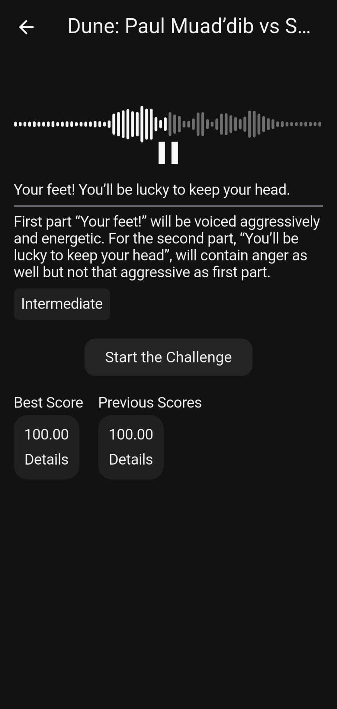

# Speech Emotion Recognition App

## Description

Built for final year project. The Speech Emotion Recognition App leverages the power of transformers to perform speech emotion recognition to help those who are aspiring to become dubbing artists by offering subjective emotion feedback. The main idea behind the implementation was to build a mobile application using Fluter to provide an user-focused experience while building a bridge to backend service which trained AI model located. The dataset is RAVDESS which contains 1440 files, 8 different emotions and 24 professional actors. (https://www.kaggle.com/datasets/uwrfkaggler/ravdess-emotional-speech-audio)

## Technologies Used

- **Frontend**: Flutter
- **Backend**: Python, Django REST Framework
- **AI Model**: PyTorch, HuBERT
- **Database**: SQLite
- **Authentication**: Django Auth

## Requirements

- Python 3.11
- Django
- Flutter
- PyTorch 2.7.0

## Installation Instructions

### Backend Setup

1. Ensure Python 3.11, PyTorch 2.7.0 and Django are installed.
2. Clone the repository and navigate to the backend directory.
3. Install required Python packages: 
   pip install -r requirements.txt
4. Create secrets.py file in folder "/django_speech_emotion_recognition/django_speech_emotion_backend/" to add necessary Google Auth variables.
5. Train model in the "/django_speech_emotion_recognition/api/util/ai_model.py" file and save checkpoint in the same folder to "/model/" as "best_model_RAVDESS_hubert.pt".
   
### Mobile Setup
1. Create secrets.dart file in project's "lib" folder and add needed variables:

   baseUrl: Backend API url. ex: http://192.123.123.12:8000/

   baseAppUrl: API url with backend app. ex: {baseUrl}api/

   refreshTokenKey: Key for caching JWT refresh token

   accessTokenKey: Key for caching JWT access token

## Usage Instructions

1. Open the app on your mobile device and log in with your registered account.
2. Select one of the challenges and try it.
3. View results and analyze your emotion performance.

### Gallery

  
  

  
  

